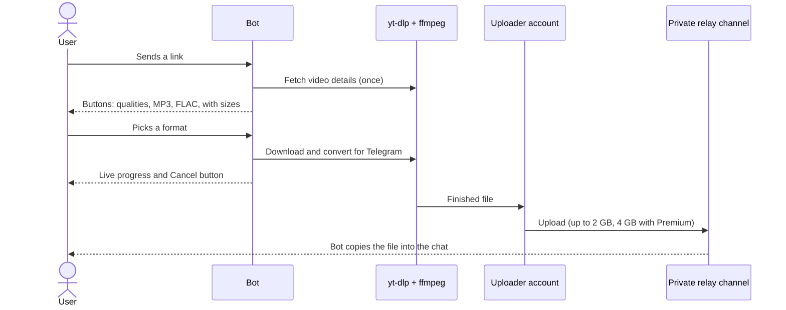

<div align="center">

# Multi-Platform Video Downloader

**A Telegram bot that turns links into videos, MP3 and FLAC files, from YouTube, TikTok and 1000+ other sites.**

No 50 MB bot limit · File size on every button · Live progress · Instant re-sends

[](https://www.python.org/)
[](https://github.com/python-telegram-bot/python-telegram-bot)
[](https://github.com/pyrogram/pyrogram)
[](https://github.com/yt-dlp/yt-dlp)
[](#setup-on-ubuntu)
[](LICENSE)

[Features](#features) · [How it works](#how-it-works) · [Setup](#setup-on-ubuntu) · [Configuration](#configuration) · [Troubleshooting](#troubleshooting)

</div>

---

Telegram bots can only upload files up to **50 MB**. This bot gets around that: a regular Telegram account uploads each file to a private channel (up to **2 GB**, or **4 GB** with Telegram Premium), and the bot copies it to the user. Files arrive as normal Telegram videos and audio with thumbnails, and anything downloaded before is sent again instantly.

<details>
<summary><b>Contents</b></summary>

- [Features](#features)
- [How it works](#how-it-works)
- [Requirements](#requirements)
- [Setup on Ubuntu](#setup-on-ubuntu)
- [Configuration](#configuration)
- [Premium custom emoji](#premium-custom-emoji)
- [Keeping YouTube working](#keeping-youtube-working)
- [Sites blocked in the server's country](#sites-blocked-in-the-servers-country)
- [Updating yt-dlp](#updating-yt-dlp)
- [Local development](#local-development)
- [Project structure](#project-structure)
- [Troubleshooting](#troubleshooting)
- [Notes](#notes)
- [Disclaimer](#disclaimer)
- [Acknowledgements](#acknowledgements)
- [License](#license)

</details>

## Features

**For users**

- 🎬 **Video qualities** from 360p to 4K, plus **Best**. They also work for vertical videos (Shorts, TikTok) and ultrawide films.
- 🎵 **MP3 (320 kbps)** and 🎼 **FLAC**, tagged with title and artist
- 📦 **Expected file size on every button** (`~66 MB`), and "too big" for files over Telegram's limit
- 📊 **Live progress** while downloading, converting and uploading: progress bar, amount, speed and time left
- ✖️ **Cancel button**: only the person who started a download, or an admin, can cancel it
- ⚡ **Instant re-sends**: a video someone already downloaded arrives in a second
- 🖼️ Videos arrive with a thumbnail, the correct size and orientation, and a readable file name
- 💎 **Premium custom emoji** in messages and on buttons
- 👥 Works in private chats, groups and forum topics

**For the bot owner**

- ⚖️ **Fair use**: one download at a time per user, hourly limits (admins are exempt), and a server-wide queue with visible positions
- 🐢 **Gentle on YouTube**: one request per link, spaced-out YouTube lookups, and a cache of video details and files
- 🎞️ Prefers H.264 + AAC, so most videos arrive without re-encoding
- 🧹 **No leftovers**: temporary files are deleted after every download, cancel, failure and timeout, and on startup
- 🛡️ **Safe defaults**:
  - refuses links to private networks and to the server itself
  - stops downloads that grow past Telegram's limit
  - checks free disk space before downloading
- 🔁 **Clean restarts**: running downloads are cancelled and their users are asked to send the link again
- 🧩 **Optional extras**:
  - cookies
  - a YouTube PO token provider
  - a download speed cap
  - an [SSH tunnel for sites that block the server's country](#sites-blocked-in-the-servers-country)
- 🖥️ Runs as a hardened, low-priority, memory-capped systemd service, so it can share a server

## How it works



1. The user sends a link. The bot fetches the video details once and shows buttons with expected file sizes: video qualities, then MP3 / FLAC.
2. The bot downloads the chosen format with yt-dlp, converts it for Telegram if needed, and shows progress with a Cancel button.
3. A Telegram **user account** (Pyrogram / MTProto) uploads the file to a private **relay channel**. User accounts can upload up to 2000 MiB (4000 MiB with Telegram Premium); bots can upload only 50 MB.
4. The bot copies the file from the relay channel to the user and deletes it from the server.
5. The relay copy is kept as a cache. When anyone asks for the same video and format again, it's sent again instantly, with nothing downloaded.

## Requirements

| | |
|---|---|
| **Server** | Linux with systemd. **Ubuntu 24.04** is recommended (on 22.04, see step 1). |
| **Python** | **3.11 or newer** (yt-dlp has deprecated 3.10) |
| **Tools** | ffmpeg |
| **Telegram** | A bot token from [@BotFather](https://t.me/BotFather), an account for uploading files (a second account is best, but any account you own works), and a private channel used as the relay |
| **Premium emoji** | **Telegram Premium on the bot owner's account** (the account that created the bot in @BotFather) |
| **Optional** | Cookies from a spare YouTube account ([Cookies](#cookies-age-restricted-videos-and-fewer-blocks)), Node.js 22+ or Docker for the [PO token provider](#po-token-provider-optional), a second server for the [tunnel](#sites-blocked-in-the-servers-country) |

`pip install -r requirements.txt` also installs Deno (needed by yt-dlp for YouTube), curl-cffi (needed for TikTok), fast upload encryption (TgCrypto) and the PO token plugin.

## Setup on Ubuntu

> [!NOTE]
> Run these commands as root or with `sudo`. Paths are absolute, so they work from any directory. The bot's folder can only be read by its own user. To look inside it, use `sudo -u videobot ls /opt/video-downloader` or a root shell.

### 1. System packages

```bash
sudo apt update && sudo apt install -y --no-install-recommends python3-venv ffmpeg
```

<details>
<summary>On Ubuntu 22.04</summary>

`python3` is 3.10 there. Install 3.11 instead and use `python3.11` in step 4:

```bash
sudo apt update && sudo apt install -y software-properties-common ffmpeg
sudo add-apt-repository -y ppa:deadsnakes/ppa
sudo apt install -y python3.11 python3.11-venv
```

</details>

### 2. Create a dedicated user

```bash
sudo useradd --system --home-dir /opt/video-downloader --create-home --shell /usr/sbin/nologin videobot
```

### 3. Copy the project

Clone or upload the project to a folder you can write to (for example `~/video-downloader-src`), then:

```bash
sudo cp -r ~/video-downloader-src/. /opt/video-downloader/
sudo chown -R videobot:videobot /opt/video-downloader
sudo chmod 700 /opt/video-downloader
```

> [!IMPORTANT]
> The folder will hold the bot token, the uploader account's login session and cookies, so only `videobot` may open it.

### 4. Python virtual environment

```bash
sudo -u videobot python3 -m venv /opt/video-downloader/venv        # python3.11 on Ubuntu 22.04
sudo -u videobot /opt/video-downloader/venv/bin/pip install -r /opt/video-downloader/requirements.txt
```

### 5. Relay channel

1. In Telegram, with the account that will upload files, create a new **private channel**.
2. Add your bot as an **admin** with *Post messages* and *Delete messages*.

### 6. Configure `.env`

```bash
sudo -u videobot cp /opt/video-downloader/.env.example /opt/video-downloader/.env
sudo -u videobot nano /opt/video-downloader/.env
```

Fill in `BOT_TOKEN`. You can leave `API_ID`, `API_HASH` and `RELAY_CHANNEL_ID` empty: the next step fills them in. See [Configuration](#configuration) for the optional settings.

> [!WARNING]
> systemd reads `.env` directly and does **not** understand comments after a value: `API_ID=123 # note` makes `123 # note` the value. Keep comments on their own lines, as in `.env.example`.

### 7. Log in the uploader account (one time)

If the bot is already running (for example when logging in again), stop it first: `sudo systemctl stop video-bot`. Then:

```bash
sudo -u videobot /opt/video-downloader/venv/bin/python /opt/video-downloader/setup_session.py
```

It walks you through everything:

1. If `.env` has no `API_ID` / `API_HASH`, it asks for them. Get them at [my.telegram.org](https://my.telegram.org) → *API development tools*, logged in with the uploader account.
2. Telegram asks for the account's **phone number** (with country code), then the **login code** it sends to your Telegram app, then the **2FA password** if the account has one.
3. It lists the channels the account is in, with their IDs. Type the number of the relay channel and it's saved as `RELAY_CHANNEL_ID`.

It creates `uploader.session`. Don't run it as root, or the bot won't be able to use the session file.

### 8. Start the bot

```bash
sudo cp /opt/video-downloader/video-bot.service /etc/systemd/system/
sudo systemctl daemon-reload
sudo systemctl enable --now video-bot
```

### 9. Check status and logs

```bash
sudo systemctl status video-bot
sudo journalctl -u video-bot -f
```

At startup the bot checks the relay channel, the upload limit, the PO token provider and the proxy, and adds `/start` and `/help` to Telegram's command menu. The log shows the result of each check.

If a setting is missing or invalid, or the uploader isn't logged in, the bot stops with a message saying so, and systemd **doesn't** restart it. Fix the problem, then run `sudo systemctl start video-bot`.

After 5 crashes in 10 minutes, systemd also stops retrying. Run `sudo systemctl reset-failed video-bot` before starting it again.

## Configuration

### `.env`

| Setting | Required | What it does |
|---|---|---|
| `BOT_TOKEN` | Yes | Bot token from @BotFather |
| `BOT_NAME` | No | Name shown in the welcome message (default: `Video Downloader`) |
| `API_ID`, `API_HASH` | Yes | Uploader account credentials from my.telegram.org (`setup_session.py` can fill them in) |
| `RELAY_CHANNEL_ID` | Yes | Private relay channel ID, e.g. `-1001234567890` (`setup_session.py` can fill it in) |
| `COOKIES_FILE` | No | Path to a `cookies.txt` ([Cookies](#cookies-age-restricted-videos-and-fewer-blocks)) |
| `POT_PROVIDER_URL` | No | PO token provider URL, e.g. `http://127.0.0.1:4416` |
| `ADMIN_IDS` | No | Your Telegram user ID(s), comma-separated. Admins are exempt from per-user limits and can cancel any download. Get yours from @userinfobot. |
| `DOWNLOAD_RATE_LIMIT` | No | Cap on download speed, e.g. `5M` (5 MB/s) or `800K`; empty = unlimited |
| `PROXY_URL` | No | Proxy for the sites in `PROXY_SITES`, e.g. `socks5h://127.0.0.1:1080` ([Sites blocked in the server's country](#sites-blocked-in-the-servers-country)) |
| `PROXY_SITES` | With `PROXY_URL` | yt-dlp site names that use the proxy, comma-separated and matched by prefix (`pornhub` also covers `PornHubUser`). Every other site connects directly. |
| `DISABLE_CUSTOM_EMOJI` | No | `true` sends plain emoji everywhere |
| `CUSTOM_EMOJI_<KEY>` | No | Override one emoji ID, e.g. `CUSTOM_EMOJI_VIDEO=5368…` ([Premium custom emoji](#premium-custom-emoji)) |

### Tunables

Change these in `config.py`. The ones marked *env* can also be set in `.env`.

| Setting | Default | What it does |
|---|---|---|
| `USER_MAX_ACTIVE_DOWNLOADS` *(env)* | 1 | Downloads one user can run at the same time |
| `USER_DOWNLOADS_PER_HOUR` *(env)* | 20 | New downloads per user per hour (cached re-sends don't count) |
| `USER_LOOKUPS_PER_HOUR` *(env)* | 60 | Links per user per hour that need fetching (cached links don't count) |
| `MAX_CONCURRENT_DOWNLOADS` *(env)* | 3 | Downloads running at once across all users; others wait in line. Use 1 on a 1-CPU server. |
| `MAX_CONCURRENT_UPLOADS` *(env)* | 3 | Uploads to the relay channel running at once |
| `INFO_WORKERS` *(env)* | 4 | Threads for fetching video details |
| `PROGRESS_INTERVAL` | 3 s | Time between progress updates (Telegram limits message edits) |
| `YOUTUBE_REQUEST_GAP` | 5 s | Minimum pause between YouTube info requests |
| `SAVED_INFO_TTL` | 30 min | How long fetched video info is reused for a download |
| `MAX_CACHED_FILES` | 2000 | Files kept in the relay channel for instant re-sending; `0` turns the cache off |
| `FILE_CACHE_TTL` | 3 days | Cached files older than this are downloaded again (sites add higher qualities after upload) |
| `VIDEO_CACHE_TTL` | 24 h | How long video details are remembered |
| `DOWNLOAD_TIMEOUT` | 30 min | Maximum time for one download |
| `MIN_FREE_DISK_BYTES` | 1 GiB | Downloads don't start if less disk space than this would be left |
| `MP3_BITRATE` | 320 | MP3 bitrate in kbps |
| `USE_ARIA2C` | False | Use aria2c (`sudo apt install -y aria2`) for multi-connection downloads. Its downloads show no progress and don't stop quickly on Cancel. Skipped while `COOKIES_FILE` is set. |

The per-user limits accept `0` for unlimited; capacity settings must be at least 1. Restart the bot after changing anything.

> [!TIP]
> **Sharing a server?**
> - `video-bot.service` gives the bot a low CPU weight (`CPUWeight=10`), so other services win the CPU when it's busy.
> - It caps the bot's memory (`MemoryHigh=900M`, `MemoryMax=1200M`).
> - It doesn't limit disk I/O or bandwidth. Set `DOWNLOAD_RATE_LIMIT` if downloads compete with other traffic (uploads to Telegram aren't capped).
>
> Adjust those lines for a dedicated server.

## Premium custom emoji

Messages and buttons use Telegram premium (custom) emoji. They only show when the **bot owner has Telegram Premium** (or the bot owns Fragment usernames). Without that, Telegram shows the normal fallback emoji.

All emoji are defined in `emojis.py` as `KEY: (custom emoji ID, fallback emoji)`:

- To change one, replace its ID in `emojis.py`, or set `CUSTOM_EMOJI_<KEY>=<id>` in `.env` without touching code.
- An empty ID uses the plain fallback emoji.
- The fallback must be the emoji the custom emoji was made for. Otherwise it looks wrong where custom emoji can't be shown (notifications, forwards by non-Premium users).
- In code, use `tg_emoji("KEY")` in message text, and `button_label()` + `icon_id()` on buttons. Never put an emoji character in a button label that also has a custom icon, or it shows twice.
- `DISABLE_CUSTOM_EMOJI=true` turns them all off.

To find a custom emoji's ID, send it from a Premium account to a raw-data bot (such as @RawDataBot) and read the `custom_emoji_id` of the `custom_emoji` entity.

## Keeping YouTube working

YouTube blocks traffic that looks automated. It treats servers much more strictly than home connections, and some server IPs are flagged before your bot sends anything. Users then see "The site is temporarily blocking the server". The bot reduces this in several ways, and you can add more.

**Built in:**

- One YouTube request per link: the info fetched when a link is sent is reused for the download.
- YouTube requests go through a queue with a pause between them, so they never arrive in bursts. Users see their position while waiting.
- Video details and uploaded files are cached, so repeated links and downloads cost no requests.
- Per-user limits stop one person from using up YouTube's rate limit. According to yt-dlp, that's about 300 videos/hour without an account and about 2,000 with one.

**You can add:**

1. [Cookies from a spare account](#cookies-age-restricted-videos-and-fewer-blocks): the biggest improvement.
2. The [PO token provider](#po-token-provider-optional): it can help, but doesn't guarantee getting past bot checks.
3. If your server's IP stays blocked, a residential proxy (paid per GB, since video data also goes through it) or hosting on a home connection.

### Cookies (age-restricted videos and fewer blocks)

> [!CAUTION]
> Using an account with yt-dlp risks getting that account banned. **Use a spare account, never your personal one.**

1. Open a private/incognito browser window and log in to YouTube.
2. In the same tab, open `https://www.youtube.com/robots.txt` (it should be the only private tab).
3. Export the `youtube.com` cookies in Netscape `cookies.txt` format with a browser extension, then **close the private window** so the browser never uses that session again.
4. Upload the file to the server (for example to `~/cookies.txt`), then:
   ```bash
   sudo install -o videobot -g videobot -m 600 ~/cookies.txt /opt/video-downloader/cookies.txt
   ```
5. Set `COOKIES_FILE=/opt/video-downloader/cookies.txt` in `.env` and restart the bot.

yt-dlp saves refreshed cookies back to the file, so `videobot` must be able to write to it. Cookies can't renew a login Google has ended. When they stop working, the log shows **"The YouTube cookies in COOKIES_FILE are no longer valid"**; export fresh ones the same way.

### PO token provider (optional)

[bgutil-ytdlp-pot-provider](https://github.com/Brainicism/bgutil-ytdlp-pot-provider) generates YouTube "proof of origin" tokens, which yt-dlp recommends. The plugin is already in `requirements.txt`; you only need to run its server (about 150 MB of RAM).

> [!IMPORTANT]
> Keep the server and plugin on the **same version (2.0.0)**. With a different major version, the plugin rejects every token.

<details>
<summary><b>Option A: Node.js under systemd</b> (needs Node.js 22+, e.g. from <a href="https://github.com/nodesource/distributions">NodeSource</a>)</summary>

```bash
sudo useradd --system --home-dir /opt/bgutil-ytdlp-pot-provider --shell /usr/sbin/nologin potprovider
sudo git clone --single-branch --branch 2.0.0 https://github.com/Brainicism/bgutil-ytdlp-pot-provider.git /opt/bgutil-ytdlp-pot-provider
cd /opt/bgutil-ytdlp-pot-provider/server
sudo npm ci && sudo npx tsc && sudo npm prune --omit=dev
sudo chown -R potprovider:potprovider /opt/bgutil-ytdlp-pot-provider
sudo cp /opt/video-downloader/bgutil-pot.service /etc/systemd/system/
sudo systemctl daemon-reload
sudo systemctl enable --now bgutil-pot
curl -fsS http://127.0.0.1:4416/ping   # {"server_uptime":...,"version":"2.0.0"}
```

</details>

<details>
<summary><b>Option B: Docker</b></summary>

```bash
docker run --name bgutil-provider -d --init --restart unless-stopped \
  -p 127.0.0.1:4416:4416 brainicism/bgutil-ytdlp-pot-provider:2.0.0
```

</details>

> [!WARNING]
> Always bind the provider to `127.0.0.1`, because it has no authentication.

Then set `POT_PROVIDER_URL=http://127.0.0.1:4416` in `.env` and restart the bot. At startup the log says whether the provider was found.

## Sites blocked in the server's country

Some sites refuse whole countries. For example, adult sites send UK visitors to an age check (users see "This video requires login"), and TikTok doesn't work from Hong Kong.

Instead of moving the bot, you can send just those sites through another server over an SSH tunnel. Every other site keeps connecting directly, so you can stay on a server that YouTube trusts.

Before setting it up, check that the other server can open those sites. It needs no extra software. Downloads through the tunnel use that server's bandwidth.

<details>
<summary><b>Set up the tunnel</b></summary>

**1. On the tunnel server** (as root), add a user that can only open connections to web ports. It gets no shell and no access to databases or panels on that server:

```bash
useradd --system --create-home --home-dir /var/lib/videotunnel --shell /usr/sbin/nologin videotunnel
install -d -m 700 -o videotunnel -g videotunnel /var/lib/videotunnel/.ssh
cp sshd-video-tunnel.conf /etc/ssh/sshd_config.d/60-video-tunnel.conf   # file from this project
sshd -t && systemctl reload ssh
```

**2. On the bot server**, create a key for the tunnel:

```bash
sudo install -d -m 700 -o videobot -g videobot /opt/video-downloader/.ssh
sudo -u videobot ssh-keygen -t ed25519 -N "" -C video-tunnel -f /opt/video-downloader/.ssh/tunnel_ed25519
sudo cat /opt/video-downloader/.ssh/tunnel_ed25519.pub
```

**3. On the tunnel server**, allow that key to forward connections and nothing else. Paste in the public key:

```bash
echo 'restrict,port-forwarding,command="/usr/sbin/nologin" ssh-ed25519 AAAA… video-tunnel' > /var/lib/videotunnel/.ssh/authorized_keys
chown videotunnel:videotunnel /var/lib/videotunnel/.ssh/authorized_keys
chmod 600 /var/lib/videotunnel/.ssh/authorized_keys
ssh-keygen -lf /etc/ssh/ssh_host_ed25519_key.pub   # note this fingerprint
```

**4. On the bot server**, trust the tunnel server's host key and start the tunnel. In these commands, replace `TUNNEL_HOST`, `TUNNEL_PORT` (its SSH port) and the example values `203.0.113.10` and `22`:

```bash
ssh-keyscan -p TUNNEL_PORT -t ed25519 TUNNEL_HOST | sudo -u videobot tee /opt/video-downloader/.ssh/known_hosts
ssh-keygen -lf /opt/video-downloader/.ssh/known_hosts   # must match the fingerprint from step 3
sudo sed -e 's/TUNNEL_HOST/203.0.113.10/' -e 's/TUNNEL_PORT/22/' -e 's/TUNNEL_USER/videotunnel/' \
  /opt/video-downloader/video-tunnel.service | sudo tee /etc/systemd/system/video-tunnel.service >/dev/null
sudo systemctl daemon-reload
sudo systemctl enable --now video-tunnel
curl --socks5-hostname 127.0.0.1:1080 https://ipinfo.io/country   # prints the tunnel server's country
```

**5. In `.env`** add these lines, then restart the bot:

```ini
PROXY_URL=socks5h://127.0.0.1:1080
PROXY_SITES=porn,youporn,redtube,tube8,xvideos,xnxx,xhamster,spankbang,eporner,youjizz,beeg,tnaflix,empflix,drtuber,sunporno,fux,txxx,thisvid,xxxymovies,zenporn,hellporno,alphaporno,lovehomeporn,sexu,nubilesporn
```

</details>

At startup the log shows `Proxy at 127.0.0.1:1080 ready for: …`.

- Site names are yt-dlp's extractor names (`yt-dlp --list-extractors`), matched by prefix, so `porn` covers PornHub, PornTube and the other `Porn…` sites.
- `socks5h` makes the tunnel server do the DNS lookups too.
- If the tunnel is down, users of those sites see "This site is temporarily unavailable", and the log says the proxy isn't reachable. `video-tunnel` reconnects by itself.

## Updating yt-dlp

yt-dlp needs frequent updates to keep up with site changes:

```bash
sudo -u videobot /opt/video-downloader/venv/bin/pip install -U "yt-dlp[default,deno,curl-cffi]"
sudo systemctl restart video-bot
```

The extras install `yt-dlp-ejs` and Deno (full YouTube support) and curl-cffi (TikTok). A plain `pip install yt-dlp` leaves them out.

## Local development

```bash
python3 -m venv venv
source venv/bin/activate
pip install -r requirements.txt
cp .env.example .env      # fill in BOT_TOKEN
python setup_session.py   # one-time login; fills in the other required settings
python bot.py
```

## Project structure

```
.
├── bot.py                  # Entry point, Telegram handlers, progress and cancelling
├── downloader.py           # yt-dlp: video info, sizes, downloads, MP3/FLAC, queues, cleanup
├── uploader.py             # Pyrogram uploader (relay channel)
├── keyboards.py            # Buttons: qualities with sizes, MP3/FLAC, Cancel
├── texts.py                # Every message the bot sends, and the command menu
├── emojis.py               # Premium custom emoji IDs
├── cache.py                # Cache of video details and uploaded files (cache.json)
├── limits.py               # Per-user limits
├── config.py               # Settings
├── setup_session.py        # One-time uploader login and relay channel picker
├── requirements.txt
├── .env.example
├── video-bot.service       # systemd unit for the bot
├── bgutil-pot.service      # systemd unit for the optional PO token provider
├── video-tunnel.service    # systemd unit for the optional SSH tunnel (PROXY_URL)
├── sshd-video-tunnel.conf  # SSH rule for the tunnel user on the other server
└── LICENSE
```

## Troubleshooting

| Log message | What to do |
|---|---|
| `Missing settings in .env: …` or `… in .env must be …` | Fix `.env` (or run `setup_session.py`, step 7), then `sudo systemctl start video-bot`. |
| `The uploader account isn't logged in yet` | Run `setup_session.py` (step 7), then start the bot. |
| `The bot is running. Stop it first` (from `setup_session.py`) | `sudo systemctl stop video-bot`, log in, then start the bot again. |
| `The uploader account can't open the relay channel` | Make the uploader account join the channel as an admin; check `RELAY_CHANNEL_ID`. |
| `The bot can't open the relay channel` | Add the bot to the channel as an admin. |
| `The YouTube cookies in COOKIES_FILE are no longer valid` | Export fresh cookies ([Cookies](#cookies-age-restricted-videos-and-fewer-blocks)). |
| `PO token provider not reachable` | Start the provider (`sudo systemctl status bgutil-pot`) or remove `POT_PROVIDER_URL`. |
| `Proxy at … isn't reachable` | Check the tunnel: `sudo systemctl status video-tunnel` and `journalctl -u video-tunnel`. |
| `PROXY_URL is set but PROXY_SITES is empty` | Add `PROXY_SITES` to `.env` or remove `PROXY_URL`, then start the bot. |
| `Could not set the bot's command menu` | Harmless: the bot works, the `/` menu just isn't updated. It's tried again at the next start. |
| `Low disk space in /tmp/video-downloader` | Free up disk space or lower `MAX_CONCURRENT_DOWNLOADS`. |
| `Could not delete relay message … delete rights` | Give the bot the *Delete messages* right in the relay channel. |
| `yt-dlp: Deprecated Feature: Support for Python version …` | Move to a newer Python (step 1). |
| Users see "This video requires login" for adult sites | The site blocks the server's country (e.g. UK age checks): see [Sites blocked in the server's country](#sites-blocked-in-the-servers-country). |
| Users see "The site is temporarily blocking the server" | YouTube flagged the server: see [Keeping YouTube working](#keeping-youtube-working). |

## Notes

- `uploader.session` must stay in the project folder. If it's deleted, stop the bot and run step 7 again (not as root).
- `cache.json` holds the cache. Deleting it is safe: the bot just downloads files again that it no longer remembers. The cache is tied to the relay channel, so switching channels clears the file cache automatically.
- The bot has at most 2 minutes to stop (`TimeoutStopSec`): running downloads are cancelled and their users are asked to send the link again.
- Links to private networks and to the server's own addresses are refused, but a public link that *redirects* to such an address isn't checked again. Keep admin panels on the server protected by a password, not only by the firewall.
- File sizes on buttons are estimates made before downloading. Videos that need re-encoding (1440p/4K from YouTube, some TikToks) are estimated generously.
- FLAC is lossless, but YouTube and TikTok only provide compressed audio, so FLAC files are bigger without sounding better than MP3.
- YouTube offers 1440p and 4K only as VP9/AV1, which the bot re-encodes to H.264 for Telegram. That's slow on small servers; 1080p and below are usually copied without re-encoding.

## Disclaimer

This project is a tool for downloading media you're allowed to download. Respect the terms of service of the sites you use and the rights of creators. Whoever runs a bot built on this project is responsible for how it's used.

## Acknowledgements

- [yt-dlp](https://github.com/yt-dlp/yt-dlp): the download engine behind every site
- [python-telegram-bot](https://github.com/python-telegram-bot/python-telegram-bot): the Telegram Bot API framework
- [Pyrogram](https://github.com/pyrogram/pyrogram): MTProto uploads past the 50 MB bot limit
- [FFmpeg](https://ffmpeg.org/): conversion, thumbnails and audio extraction
- [bgutil-ytdlp-pot-provider](https://github.com/Brainicism/bgutil-ytdlp-pot-provider): YouTube PO tokens

## License

Released under the [MIT License](LICENSE).
